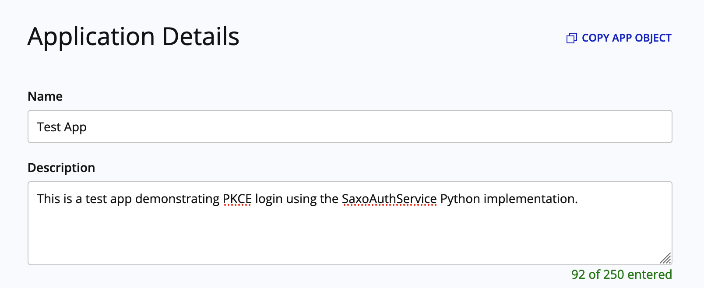

# Saxo Auth Service Sample Impementation

> Note: this module uses modern type hint syntax and requires Python >= 3.10

This sample features a custom class `SaxoAuthService()` which handles:

- Parsing of OpenAPI App Object data and other datamodels
- Login using the app config data and a `Flask` server to catch the redirect
- Token retrieval (using `auth_code` or `refresh_token`)
- Disconnecting from Saxo (by removing auth token data from the class)

The implementation supports both `Code` and `PKCE` grant types and works in the `SIM` and `LIVE` environments.

## Requirements

See `requirements.txt`. This specific sample uses:

- `requests` (to process token requests)
- `Flask` (to create a redirect server)
- `pydantic` (to parse and validate datamodels)

## How do I use this implementation?

First, you'll need an application [registered with Saxo OpenAPI](https://www.developer.saxo/openapi/appmanagement). A free Developer Account is required ([create one here](https://www.developer.saxo/accounts/sim/signup)).

When creating your app, make sure to either pick `Code` or `PKCE` as the Grant Type - both are supported.

Once the app is created, click **Copy App Object** on the top right on the Application Details screen:



Next, run the following code (make sure `saxo_auth_service.py` and `models.py` are available in your directory).

```Python
from saxo_auth_service import SaxoAuthService, parse_app_config

app_config = {
    "AppName": "Your application config data is pasted here...",
    "AppKey": ...,
    "AuthorizationEndpoint": ...,
    "TokenEndpoint": ...,
    "GrantType": ...,
    "OpenApiBaseUrl": ...,
    "RedirectUrls": [...],
    "AppSecret": ...,
}

saxo_auth = SaxoAuthService(parse_app_config(app_config))
```

You can now use the `saxo_auth` object to do the following three operations (see also `sample.py` for a runable script).

### 1. Log in
``` Python
saxo_auth.login()
```
This function automatically reads the application configuration, opens your webbrowser with the correct authentication url, and creates a server to listen to the callback from Saxo SSO.

The following output will be shown in the terminal when the login flow is completed successfully:

```
2022-05-13 21:20:45,251 | DEBUG | logging in to app: 'Test App' using GrantType.CODE
2022-05-13 21:20:45,251 | DEBUG | redirect url for callback: http://localhost:11321/redirect
2022-05-13 21:20:45,251 | DEBUG | browser will be opened with following url: auth_url='https://sim.logonvalidation.net/authorize?...'
2022-05-13 21:20:45,414 | DEBUG | starting server and listening for callback from Saxo...
2022-05-13 21:20:48,003 | INFO | 127.0.0.1 - - [13/May/2022 21:20:48] "GET /redirect?code=[...]&state=_HVYrM_NsF8rnQ HTTP/1.1" 200 -
2022-05-13 21:20:48,420 | DEBUG | terminating server...
2022-05-13 21:20:48,505 | DEBUG | authentication successful!
2022-05-13 21:20:48,512 | DEBUG | Starting new HTTPS connection (1): sim.logonvalidation.net:443
2022-05-13 21:20:48,648 | DEBUG | https://sim.logonvalidation.net:443 "POST /token?... HTTP/1.1" 201 622
2022-05-13 21:20:48,649 | DEBUG | access & refresh token created/refreshed successfully
```

`SaxoAuthService` is now authenticated and contains a valid `access_token` property. This access token can be used for requests to Saxo OpenAPI.

``` Python
print(saxo_auth.access_token)

> eyJhbGciOiJFUzI1NiIsIng1dCI6IkRFNDc...
```

For instance, loading user data of the logged-in user can be done by running:

``` Python
response = requests.get(
    url=f"{saxo_auth.api_base_url}port/v1/users/me",
    headers={"Authorization": f"Bearer {saxo_auth.access_token}"},
)
print(response.json())

> {'ClientKey': '...', 'Culture': 'en-US', 'Language': 'en', 'LastLoginStatus': 'Successful', ...
```

### 2. Refresh the session

The access token is valid for 20 minutes from the moment it is created. In order to refresh the token, `SaxoAuthService` exposes a `refresh()` function that automatically performs the required operations to update the `access_token` variable.

``` Python
saxo_auth.refresh()

print(saxo_auth.access_token)

> eyJhbGciOiJFUzI1NiIsIng1dCI6IkRFNDc...  # this is the refreshed access token
```

### Log out and disconnect from OpenAPI

In order disconnect, `SaxoAuthService` provides a function `logout()`, which removes all token data and resets the object. 

``` Python
saxo_auth.logout()

print(saxo_auth.logged_in)

> False
```
